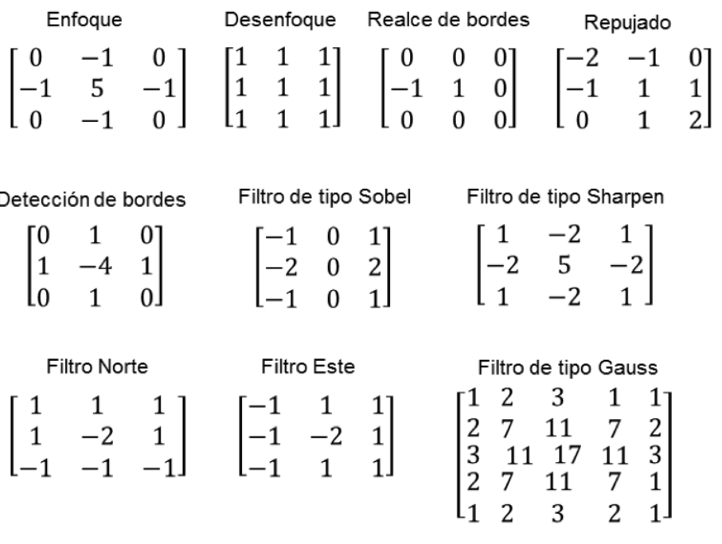
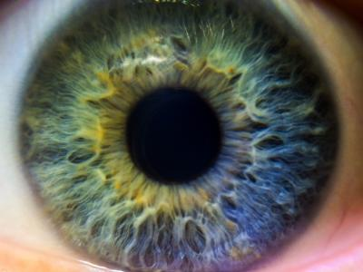
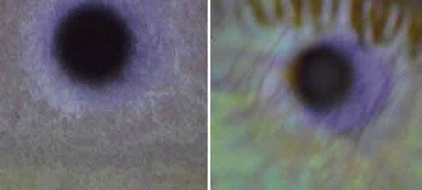
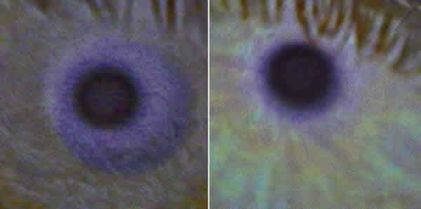
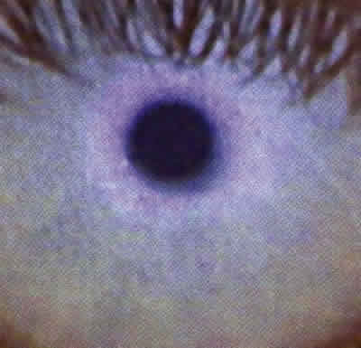
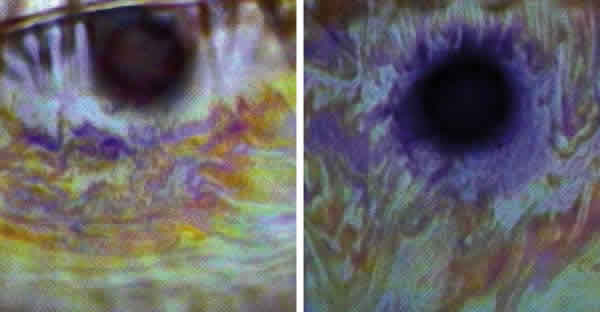
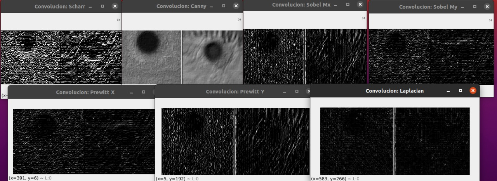

# Patrones_oculares
### Uso de la convolución para detección de patrones interferenciales (lagrimales) oculares
El proceso de filtrado de una imagen permite resaltar patrones e información importante de una imagen para diversos propósitos.
La convolución permite el filtrado de imágenes, y este filtrado se puede llevar a cabo con diversos métodos con el uso de máscaras o kernels.

Los filtros más comúnes son:
* Pasa bajo: se trata de suavizar la imagen o de resaltar alguna información específica (Ej. media, mediana, Guassiano).
* Pasa alto: es en el que se resaltan las zonas que tienen mayor variabilidad en la imagen.
* Detección de bordes: detectan los bordes de las imágenes utilizando diferentes kernels.

Una de las aplicaciones en las que se puede utilizar el filtrado de imágenes mencionado anteriormente es en el análisis de **patrones interferenciales oculares** para la determinar la eficiencia de los lentes de contacto en diversos pacientes.
La manera en la que se puede llevar a cabo este procedimiento es a través de la implementación de filtros sobre imágenes de ojos con la finalidad de detectar los bordes e identificar el patrón.

Los patrones interferenciales oculares a ser identificados son:
* Patrón Marmóreo Abierto: Se forma una capa de color mármol grisáceo. Este patrón representa a los pacientes que presentar resequedad en el ojo al momento de utilizar lentes de contacto.

* Patrón Marmóreo Cerrado: Se presenta de una forma similar a la de marmóreo abierto, sin embargo, es más denso. Los pacientes que presentan este este patrón no tienden a tener problemas al momento de utilizar lentes de contacto.

* Patrón Amorfo: Se presenta un color azul grisáceo. Este patrón se presenta en los pacientes que pueden utilizar lentes de contacto, pero que en algunos momentos pueden tener problemas de acumulación de grasa.

* Patrón Coloreado: Se pueden observar líneas de colores amarillo, café y azul. El problema que presentan los pacientes con este patrón es que el lente de contacto se puede contaminar fácilmente ya que se presenta una gran cantidad de lípidos.

IMAGEN DE RESULTADO IMPLEMENTADO EL CÓDIGO EN PATRÓN MARMÓREO ABIERTO

Los filtros utilizados en las pruebas de Patrones Oculares son:
* Repujado -> utilizado como prefiltro para la sobreexposición de bordes y facilitar la detección de los mismos.
* Sobel
* Canny
* Prewitt
* Laplasian
* Scharr

#### Ejecución y pruebas del programa
La manera en la que se debe ejecutar el programa es utilizando alguna terminal de Linux o de Mac o bien instalar un emulador de Linux en Windows. 
Después, se deben descargar las imágenes "abierto.jpg" (patrón marmóreo abierto), "cerrado.jpg" (patrón marmóreo cerrado), "amorfo.jpg" (patrón amorfo) y "franjasColoreadas.jpg" (patrón coloreado).
Posteriormente, se debe clonar el repositorio y correr el programa principal de Convolución.py utilizando el comando python3.El único cambio que se debe realizar (con un IDE externo o desde la misma terminal utilizando el comando sudo vim Convolucion.py) es cambiar la ruta de la imagen por la ruta de la imagen descargada del patrón que se quiere analizar.
Lo que se debe mostrar es el la imagen del patrón filtrada con las diferentes máscaras.

#### Programa construido con
* Python
* OpenCV
* Terminal Ubuntu

#### Autores
Brenda Castillo - Creación del repositorio y branch Sobel

Leonardo Galindo - Creación de la branch develop y branch Canny

Ulises Venegas - Creación de la branch Prewitt

Diego Ortiz - Creación de la branch Scharr

Owen Jauregui - Creación de la branch Laplasian

#### Referencias
* Patrón Interferencial ocular

Muñoz, H. (2009). Variación del patrón lipídico. "Universidad de La Salle". Recuperado de: https://ciencia.lasalle.edu.co/cgi/viewcontent.cgi?article=1063&context=optometria

* Filtrado de imágenes

Giménez, F. (2016). Aplicación de la convolución de matrices al filtrado de imágenes. "Research Gate". Recuperado de: https://www.researchgate.net/publication/292187589_Aplicacion_de_la_convolucion_de_matrices_al_filtrado_de_imagenes

* Códigos de referencia

Pillco, J. (2019). Preprocesado de imágenes usando filtros de convolución. "Universidad de San Antonio Abad del Cusco". Recuperado de: https://www.researchgate.net/publication/335796291_Preprocesado_de_imagenes_usando_filtros_de_convolucion 
